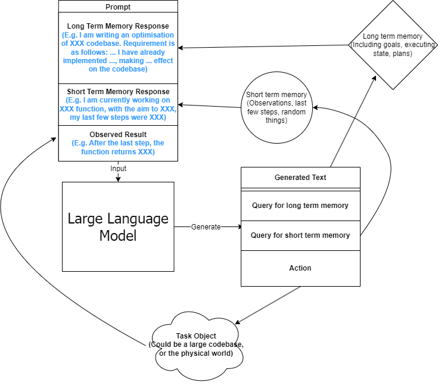

# Book piZzA: GPT Conversational Read Eval Print Loop and Bookmarks Management System for Text (WIP)

Interactive books. Books sliced up like pizza. Book pizza. bza.

First input text,

feed it (sliceSize) pages at a time into chatgpt or another LLM, summarizing as it goes

then prompt user for a command e.g.
- print out the slice of pages
  - in the voice of a character,
  - translate into spanish
- print out the summary of content up to this point
- generate a quiz and grade it
- continue on to the next page slice

It's an active reading buddy, a summarizer, a customizable narrator and reteller.

And it stores all this into "bookmarks" from which can resume our session in a local database. (where we can also do things like store vector represenations of all the pages of the books to compute cosine similarity to use when prompting the LLM)

## To Run (TODO)
- if windows, install [windows subsystem for linux](https://learn.microsoft.com/en-us/windows/wsl/install)
- install [the nix package manager](https://nixos.org/download.html)
- install [Git](https://git-scm.com/book/en/v2/Getting-Started-Installing-Git)
- open a terminal or shell (if you don't know how, you could ask chatgpt...)
- `git clone https://github.com/NotBrianZach/bza.git`
- `cd bza`
- get $OPENAI_API_KEY key [here](https://platform.openai.com/account/api-keys) if u dont have
- `export OPENAI_API_KEY=$OPENAI_API_KEY`
- `nix-shell` (might take a few minutes to download and install dependencies)
- `npm install`
-  `bza load <path_to_markdown_file>`
- or
-  `bza resume Frankenstein`
- or
-  `bza print`  (shows current booksmarks, e.g. Frankenstein)
- open an issue detailing why doesnt work

## Convert to Markdown, Conversion Tools

FIRST, must complete all steps in TO RUN

We love markdown because it is close to plaintext and easy to read in raw format for both humans and gpt. It makes copy&paste into prompt, andls
rm stnshell scripting easy while still allowing for hyperlinks, latex, and image embedding.

So, before we can add more articles to our library, we need to convert to markdown using best available tools:

for utility function definitions, see shellHook in shell.nix

- html
  - a website
    - `url2md -u  https://example.com  -o "example.md"` # this is a wrapper for wget in shellHook in shell.nix
  - local html
    - `html2md ./library/sources/Frankenstein.html`
      - this will create a directory ./library/Frankensteind
        - a file ./library/Frankensteind/Frankenstein.md
        - and a subdirectory ./library/Frankensteind/imagesD/
    - (html2md <sourceUrl> [outputFilePath], image directory will be filename+d)
- pdf (also images&docx):
  -  https://cloudconvert.com/pdf-to-html just use this then see earlier instructions for html files using html2md bash function,
    - otherwise ...
    - if you really want to fine tune your pdf parsing...
    - to parse pdfs into structured text locally we'll use [parsr](https://github.com/axa-group/Parsr) which we'll have to install via docker
      - alternatively try https://github.com/Unstructured-IO/unstructured which should work similarly I think (langchain uses this)
    - it's recommended to use parsr gui (parsr api is complex), it can be reached at localhost:8080 if that port was not already in use
      - nix-shell -p docker
      - dockerd &
      - docker pull axarev/parsr
      - docker pull axarev/parsr-ui-localhost
      - docker run -p 3001:3001 axarev/parsr &
      - docker run -t -p 8080:80 axarev/parsr-ui-localhost:latest &
    - it takes quite some time for this tool to run btw, like a lot, it's a NLP tool
    - maybe someone should make a LLM version that is way better and works 99% of the time lol (that would be good enough for us)
- epub
  - pandoc -i /path/to/file.epub -o /path/to/output.md

- EXPERIMENTAL attempt to clean badly formatted tables or latex with gpt3.5-turbo (might try tweaking prompt if doesn't work, takes a few minutes and costs about a dollar for every 100 pages as of this writing)
  - gptClean <inputFile> [outputFilePath]
    - defaults to inputFilePath + "cleaned.md"

## TODO Read Markdown
- to read the markdown we use ink-mde

TODO

### Event Loop Setup:
0. - IF db has an entry for bookName, load title & synopsis & rollingSummary from there
   - ELSE prompt user for title&synopsis, and get pageNumber&sliceSize from commandline params or defaults (0,2)
     - you can, for example, have gpt make a synopsis for you by copy pasting abstract or table of contents into e.g. openai playground and prompting it to summarize said abstract or table of contents
   - finally initialize rollingSummary="this is the start of the document"
## Event Loop: Giving Gpt3 Short & Long Term Memory
1. const pageSlice = pages.slice(pageNumber,pageNumber+sliceSize)
2. pageSliceSummary=queryGPT(summarize pageSlice given title+synopsis+rollingSummary)
3. get User Input, act on input
4. rollingSummary=queryGPT3(further contextualize pageSlice with respect to rest of book, this will act as a summary of previous pages for next pageSliceSummary)
5. WHILE (pageNumber < bookLength), set pageNumber=pageNumber+sliceSize, jump back to 1. else continue to 6.
6. parting thoughts from gpt3, call onExit method (cleanup)

## User Input (Step 3 Event Loop):
##### NAVIGATE
- next=continue to next pageSlice,
- jump=jump to input pageNumber,
- exit= exit program, save db bookmark
##### ASK USER for input
- startConversation = start conversation w/specified prompt; without subcommands assumes "start title synopsis rollingSummary pageSliceSummary pages", saves previous conversation if applicable
  - title = append title
  - synopsis = append synopsis
  - rollingSummary = append pageSliceSummary
  - pageSliceSummary = append pageSliceSummary
  - pages = append pageSlice
- continueConversation = continue conversation, multiline input, }}} to terminate (if no current conversation assume start default)
<!-- - restart="restart" save current conversation to db, restart conversation w/only initial prompt  -->
- "hard restart conversation"= restart conversation w/only initial prompt, NO save to database
  - same subcommands as start
# TODO SUBLOOP OVERHUAL USING LLM PSEUDOLANGUAGE https://github.com/NotBrianZach/gpt-jargon (need database integration though... tricky.)
##### SUBLOOP COMMANDS
- quiz= run quiz loop once
- toggleQuiz= toggles quiz loop, print boolean value
##### PRINT TOGGLES: print to console, and enable/disable printing in event loop
- h or help = show options
- pSlice="summary of page slice" print gpt summary of the current slice of pages
- pRoll="rolling summary" print gpt summary of everything up to this point (short term memory)
- narrate= rewrite all output in the voice of a character
- voiceOut= TODO "Voice output" use ?[TTS](https://github.com/coqui-ai/TTS)? to generate voice to narrate gpt response & queries to user
- voiceIn= TODO "voice input"  use ?whisper?/?talon? to allow voice input
##### LLM PROMPT MODIFICATION: change all non-summary llm queries going forward
- before= get user input, prepend to conversation prompt
  - "tell a joke about the following text:"
- delBefore=delete stack of prepended prompts
- after= append next user query input to all non summary gpt requests
  - "...tell another joke about the above text that ties into the first joke"
- delAfter= delete stack of appended prompts
- maxToken=change response length/max token count (default 2000, max = 4096 includes prompt)
##### LLM SUMMARY PROMPT MODIFICATION: change all summary llm queries going forward
- beforeSummary= prepend user input to summarization prompt
  - "You are helping a student cram for a test"
- delBeforeSummary=delete stack of prepended prompts
- afterSummary= append next user input to all summary gpt requests
  - "...and make it light hearted and funny"
- delAfterSummary= delete stack of appended prompts
- maxTokenSummary=change response length/max summary token count (default 2000, max = 4096 includes summary prompts)

### SubLoops (e.g. quizzes):
#### Quiz (quiz user and grade responses)
if toggled on, start after step 2 in Event Loop
1. query gpt3 to generate quiz, print quiz,
2. get user input for answers, multine input, }}} to terminate
3. query gpt3 for "grade", explain "wrong" answers
4. get user input, options:
      - done=exit&save a log of the quiz&answers,
      - delete=don't log quiz
      - c=converse with gpt about quiz, multiline input, }}} to terminate
      - again=run quiz loop again, saving log
      - againFresh=run quiz loop again, don't log
5. get User Input (default options)

#### Teach
- TODO mode where gpt pretends not to know and asks you to teach it

#### Feeback
- TODO mode where gpt provides a running meta commentary on user input or approval/disapproval meant to emulate social media like button dopamine for users

## BZA Command Line
- <> = required argument, [] = optional arguments, ;; = comment (not part of command)
- bza resume <bookmarkName> [timestamp] ;; (bookmarkName usually = title, timesteamp defaults to most recent) resumes from an old bookmark, creating a new one
- bza load <filepath> [pageNumber] [sliceSize] [charPerPage] [narrator] [isPrintPage] [isPrintSliceSummary] [isPrintRollingSummary] ;; load markdown file, create new bookmark, run eventLoop
- bza gptDB   ;; for fun, ask gpt, given db schema as pre-prompt, to create db query to either select from or update database, print command, then type yes to run or n to cancel (might not be executable)
- bza print [orderBy] [numberToPrint] ;; prints bookmarks, 10000 by default, orderBy= "tStamp", "bTitle", "synopsis", "pageNum", "filePath", "narrator"

## Other Configuration:
can modify eventLoop prompts in genPrompts.mjs

see [initDB.mjs]() for database schema
or

0. nix-shell if not already in a nix shell
1. `sqlite3 bookmarks.sq3`
2. `.schema` to print db schema

can do `.help` to list some other commands (e.g. .tables)

could create another file e.g. alterDB.mjs which has alter table statements if you wanted to change db schema (to add an articleType or something)

## Future Work

- get basic functionality working
- text to speech  https://github.com/suno-ai/bark ; speech to text https://github.com/openai/whisper
- use https://github.com/NotBrianZach/ink-mde, open browser start server and create notifications that push to markdown viewing/editing client whenever user switches pages (wip)
- https://github.com/karpathy/randomfun/blob/master/knn_vs_svm.ipynb on book pages vector array option to get relevant context (wip)
- recognize images and sumarize their meaning into text (when we get access to good multimodal models)
- categorize query types (other than just summarize/non summarize) and allow for loop and prompt stack creation within repl itself? (wip)
- more programmability: maybe "vim like" language to create context stacks inside repl and store them in either db or key value store (or db emulating key value store)
- multimodality?
- multiplayer repls? (idk websocket or something)
- package for nixos,brew,apt, (window - winglet?)
- ?hyena optional full book context?
- investigate langchain & https://github.com/Unstructured-IO/unstructured
- bza for other media types (e.g. movies, music, etc);
  - chrome plugin that follows along with youtube video transcript and interrupts to ask questions/summarize/etc

## Naming
The naive/correct pronounciation sounds like pizza, which is typically sliced into pieces just like we are sliceing up books. Book pizza.

bza is also my initials. #branding

and bza is a short three letter word which is not too overloaded and can be invoked easily on the command line.

Makes total sense.

## Inspiration
if interested in this project you may find this interesting as well:
https://github.com/thunlp/PromptPapers

i have kept, for a couple years, a reading list with commands like

"""

0-
ebook-viewer ~/media/books/TheDividedSelf2010.epub --open-at 59

0-
xpdf ~/media/books/tcp_ip_networkadministration_3rdedition.pdf 50 -z 200

xpdf ~/media/books/LinuxProgrammingInterface2010.pdf

"""

in a file in my /home/$user/media directory so i could read books from command line and record current position

i had also been looking for technically inclined book club without luck (well i didnt try super hard)

a thought had been bubbling in my head that I wanted to read books alongside gpt3,

i had previously spent quite some time trying to make multi player choose your own adventure novels a thing (TODO make it so you can talk to multiple different llms or prompts at once or share a repl session with your buddy or something TODO)

in my opinion, computers have a vast potential to create new narrative structures

then i saw this reddit post

https://www.reddit.com/r/singularity/comments/11ho23y/first_post_in_reddit_mistakely_used_a_text_post/

and a within a couple minutes (well, techincally, i had started working a bit the day before on a book2quiz concept (it did still involve sliceing through book just like this)), after some good ole reddit arguing, i started writing this

[original link](https://github.com/NotBrianZach/gptbook2quiz)

## Pushdown Large Language Models

a final thought, about fundamental models of computation

the theoretical taxonomy of computation looks like this

finite state machines -> have subset of functionality of -> context free grammars -> have subset of functionality of -> turing machines

traditional narratives are simple finite state machines at the level of pages

most choose your own adventure novels are also finite state machines, though they have a bit more structure since they are not purely sequential

the way I wanted to implement multiplayer choose your own adventure novels,

i believe they would have been more akin to a push down automata, or context free grammar,

since the story would maintain a list of invalidated edges (which could also be thought of as a unique class of "intermediate" node that dont branch),

and transitions between nodes (player choices) could change the choices available to other players

i think there is a similar analogy going on here.

reddit user SignificanceMassive3's diagram displays a "context free" or "pushdown" large language model (ignore the fact the diagram has two stacks and is ?probably? technically turing complete, we don't push to our long term context after we define it, well, mostly... Look buddy we are operationally a pushdown automata!)

which, much like a regular expression is suitable for matching patterns in text, a "push down llm" is suitable for the task of reading along with longer form text
