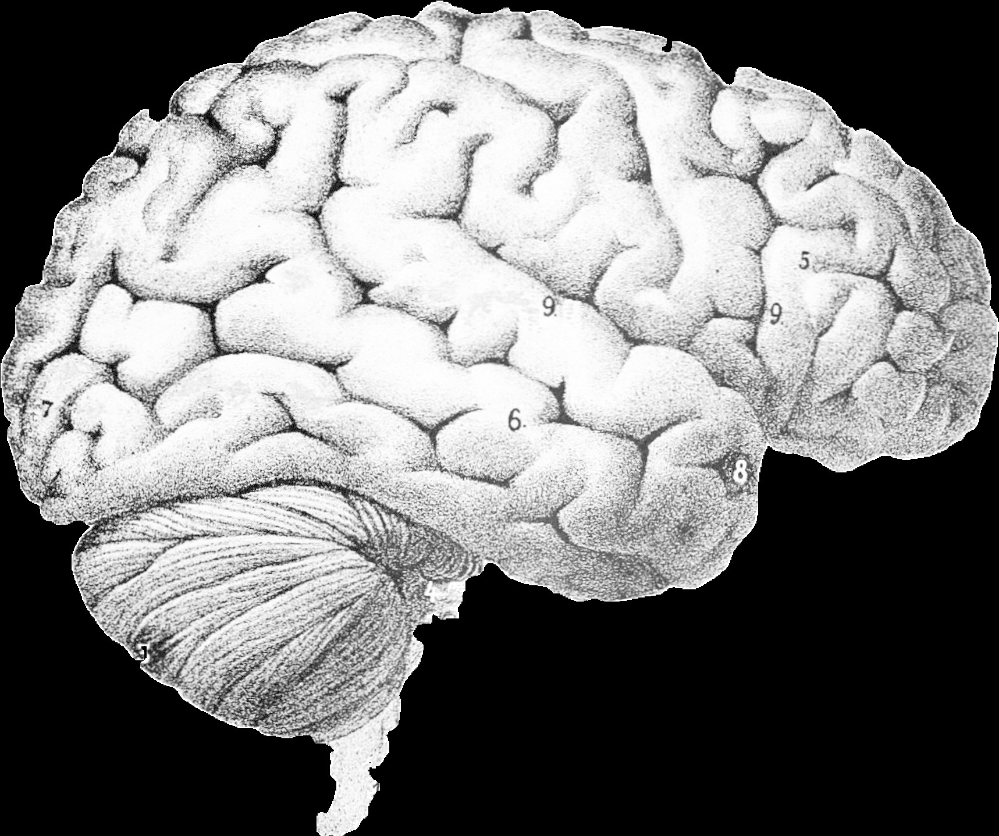
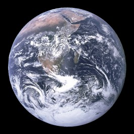
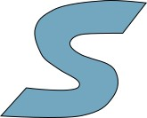
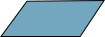
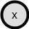

---

---

---

---

---

---

---

---

---

---

---

---

---

---

---

---

---

---

---

---

---

---

---

---

---

---

---

---

---

---

---

---

---

---

---

---

---

---

---

---

---

---

---

---

---

---

---

---

---

---

---

---

---

---

---

---

---

---

---

---

---

|| Method | Energy | y ˆ Generation | Loss |  
|---|---|---|---|---|  
| 1 2 3 4 5 6 6 7 8 9 10 | Max Likelihood Max Likelihood Max likelihood Contr. Divergence Pairwise Hinge Min-Hinge Square-Hinge Square-Exp Logistic GAN Denoising AE | discrete y tractable any any any positive divergence any any any D(y,gw(y)) | exhaustive exhaustive MC or MCMC trunc’d MCMC most offending most offending most offending most offending most offending y ˆ = gu(z) y ˆ = N(y) | Fw(x,y) − Fw(x, y) ˆ Fw(x,y) − Fw(x, y) ˆ [Fw(x,y) − Fw(x, y) ˆ + m(y, y)] ˆ + Fw(x,y) + [m(y, y) ˆ − Fw(x, y)] ˆ + y 0 ∈Y exp(−Fw(x,y 0 )) y 0 ∈Y exp(−Fw(x,y 0 )) Fw(x,y) + log P Fw(x,y) + log R Fw(x,y) 2 + ? [m(y, y) ˆ − Fw(x, y)] ˆ +?2 Fw(x,y) 2 + exp(−βFw(x, y)) ˆ log(1 + exp(Fw(x,y) − Fw(x, y)) ˆ H(Fw(x,y),Fw(x, y),m(y, ˆ y)) ˆ D(y,gw(ˆ y) |  

